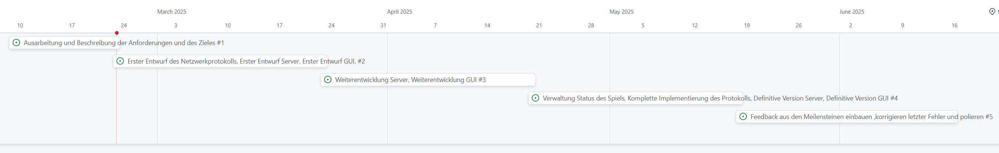

## Dokumentation WebE Semesterarbeit

### David Ritter, Enzo Mazotti

### Idee und Ziel des Spieles

Die Idee unserer Arbeit ist eine Online-Version vom Spiel Montagsmaler.
Montagsmaler ist ein bekanntes Partyspiel,
bei dem eine Person ein Wort oder einen Begriff zeichnet, während die anderen Spieler versuchen,
diesen Begriff innerhalb einer bestimmten Zeit zu erraten.
Das Ziel ist es, möglichst viele Begriffe korrekt zu erraten und Punkte zu sammeln.

### **Spielablauf:**

- Ein Spieler wird zufällig als "Zeichner" bestimmt.
- Der Zeichner erhält ein zufälliges Wort aus einer vordefinierten Datenbank.
- Die anderen Spieler sehen die Anzahl der Buchstaben des gesuchten Wortes.
- Die Spieler geben ihre Antwort in ein Eingabefeld ein.
- Der erste Spieler, der das Wort korrekt errät, erhält die meisten Punkte, der zweite und dritte erhalten weniger
  Punkte.
- Nach einer bestimmten Zeit oder wenn das Wort erraten wurde, wird der nächste Spieler als Zeichner bestimmt.
- Das Spiel endet nach 3 Runden, also nachdem jeder Spieler 3 Mal gezeichnet hat.

### **Spielregeln:**

- Das Spiel kann mit mindestens **2** und maximal **10** Spielern gespielt werden.
- Der Zeichner darf keine Buchstaben oder Zahlen in die Zeichnung integrieren.
- Es gibt eine festgelegte Zeitlimite, um das Wort zu erraten.
- Der Spieler mit den meisten Punkten am Ende gewinnt.
- Im Falle eines Gleichstands kann eine zusätzliche Runde gespielt werden.

## Anforderungen

### Funktionale Anforderungen

| ID   | Name                     | Ziel                                                                   | Ereignis                | Muss/Kann |
|------|--------------------------|------------------------------------------------------------------------|-------------------------|-----------|
| FA1  | Registrierung            | Ein Spieler kann sich registrieren.                                    | Nutzerregistrierung     | Muss      |
| FA2  | Login                    | Ein Spieler kann sich mit seinem Account anmelden.                     | Nutzerauthentifizierung | Muss      |
| FA3  | Logout                   | Ein Spieler kann sich ausloggen.                                       | Beendigung der Sitzung  | Muss      |
| FA4  | Spiel erstellen          | Ein Spieler kann ein neues Spiel erstellen.                            | Lobby-Erstellung        | Muss      |
| FA5  | Beitrittscode teilen     | Ein Spieler kann den Code zum Beitreten mit anderen teilen.            | Lobby-Einladung         | Muss      |
| FA6  | Spieler beitreten        | Ein Spieler kann einem bestehenden Spiel beitreten.                    | Lobby-Beitritt          | Muss      |
| FA7  | Wort zufällig generieren | Der Zeichner erhält ein zufälliges Wort.                               | Start der Runde         | Muss      |
| FA8  | Zeichnung übermitteln    | Die Zeichnung des Zeichners wird in Echtzeit allen Spielern angezeigt. | Während der Runde       | Muss      |
| FA9  | Antwort senden           | Spieler können Antworten in ein Eingabefeld eintippen.                 | Während der Runde       | Muss      |
| FA10 | Punktevergabe            | Punkte werden basierend Geschwindigkeit der Antworten vergeben.        | Antwort richtig         | Muss      |
| FA11 | Rundenmanagement         | Nach einer Runde wird der nächste Zeichner bestimmt.                   | Ende der Runde          | Muss      |
| FA12 | Spielende                | Das Spiel endet nach 3 Runden.                                         | Nach 3 Runden           | Muss      |
| FA13 | Globales Scoreboard      | Bestenliste mit Spielern mit den höchsten Punkten.                     | Spielende               | Kann      |
| FA14 | Mehrere Spielmodi        | Unterschiedliche Spielvarianten (z.B. Zeitmodus).                      | Spielstart              | Kann      |
| FA15 | Chat-Funktion            | Spieler können während der Runde chatten.                              | Während der Runde       | Muss      |
| FA16 | Fehlerbehandlung         | Das Spiel zeigt Fehlermeldungen bei kritischen Fehlern an.             | Während der Runde       | Muss      | 

### Nicht-funktionale Anforderungen

| ID   | Name                   | Ziel                                                                                                       | Muss/Kann |
|------|------------------------|------------------------------------------------------------------------------------------------------------|-----------|
| NFA1 | Performance            | Das Spiel soll ohne Verzögerungen spielbar sein.                                                           | Muss      |
| NFA2 | Skalierbarkeit         | Das System soll bis zu 10 Spieler in einem Spiel, sowie mehrere gleichzeitig laufende Spiele unterstützen. | Muss      |
| NFA3 | Benutzerfreundlichkeit | Eine intuitive und einfache Benutzeroberfläche.                                                            | Muss      |
| NFA4 | Sicherheit             | Spielerdaten sollen sicher gespeichert und verarbeitet werden.                                             | Muss      |
| NFA5 | Responsive Design      | Das Spiel soll auf verschiedenen Bildschirmgrössen spielbar sein.                                          | Muss      |

### Verwendete Technologien und Bibliotheken

- **Frontend:** React.js, Next.js, ShadCN, Tailwind CSS
- **Backend:** Node.js, Express.js
- **Echtzeit-Kommunikation:** WebSockets (Socket.io)
- **Datenbank:** MongoDB

## Kommunikation zwischen Client und Server

### REST-Calls für grundlegende Aktionen

Für grundlegende Aktionen wie Registrierung, Login oder Spielverwaltung verwenden wir REST-Calls. Diese basieren auf
HTTP und bieten einfache Anfragen für nicht zeitkritische Aufgaben.

| HTTP-Methode | Endpunkt                    | Zweck                              |
|--------------|-----------------------------|------------------------------------|
| `POST`       | `/api/register`             | Registrierung eines neuen Spielers |
| `POST`       | `/api/login`                | Spieleranmeldung                   |
| `POST`       | `/api/logout`               | Spieler ausloggen                  |
| `POST`       | `/api/game/create`          | Neues Spiel erstellen              |
| `GET`        | `/api/game/join/{gameCode}` | Spieler tritt einem Spiel bei      |
| `GET`        | `/api/scoreboard`           | Globales Scoreboard                |

### WebSocket-Kommunikation für Echtzeit-Daten

Für die Echtzeit-Kommunikation im Spiel verwenden wir **WebSockets (Socket.io)**. Diese ermöglichen eine sofortige
Übertragung von Spielereignissen wie Zeichnungen, Antworten und Punktestand-Updates.

| Nachrichtentyp | Sender | Empfänger | Zweck                                                 |
|----------------|--------|-----------|-------------------------------------------------------|
| `player_join`  | Client | Server    | Ein Spieler tritt der Lobby bei.                      |
| `new_round`    | Server | Client    | Ein neuer Zeichner wird bestimmt, Wort wird gesendet. |
| `draw_data`    | Client | Server    | Zeichnung wird übertragen.                            |
| `guess_word`   | Client | Server    | Spieler sendet seine Antwort.                         |
| `correct_word` | Server | Client    | Das Wort wurde korrekt erraten.                       |
| `update_score` | Server | Client    | Punktestand wird aktualisiert.                        |
| `game_end`     | Server | Client    | Das Spiel endet.                                      |

### Ablaufplan der Semesterarbeit

Link zum öffentlichen Github Project mit dem Gantt-Diagramm: https://github.com/users/davidritter-dotcom/projects/2

